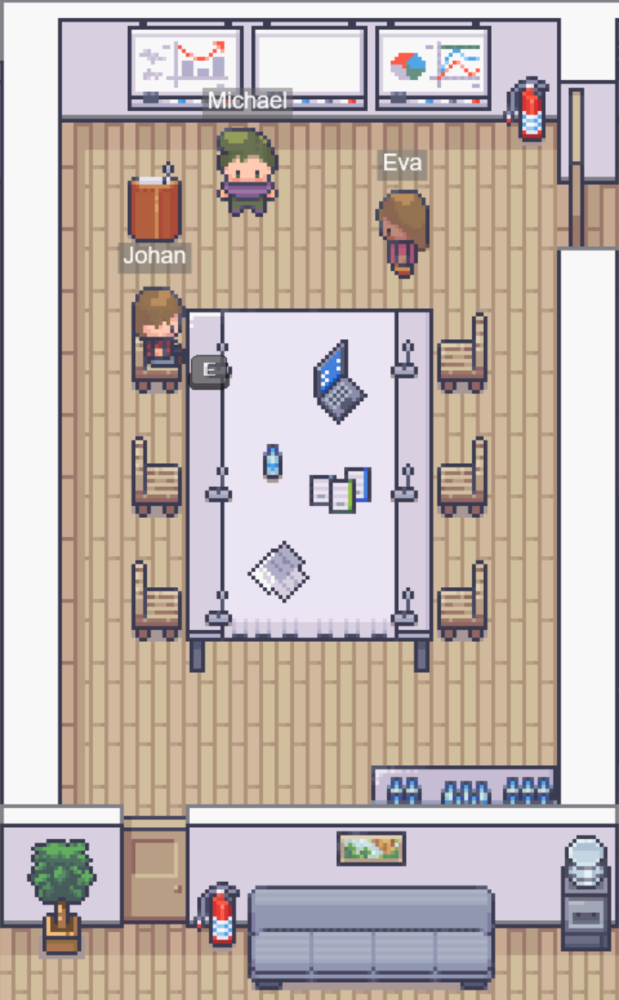
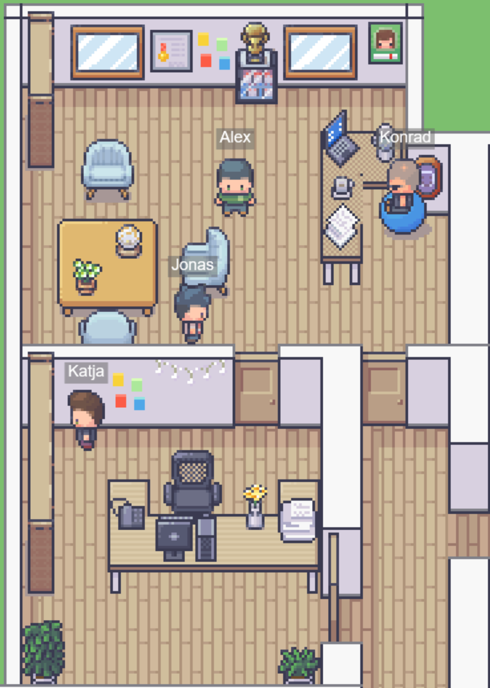
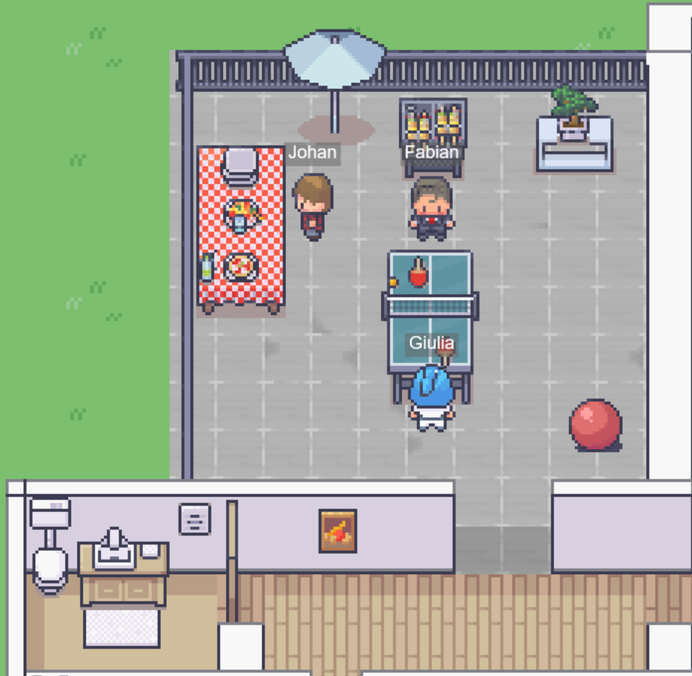
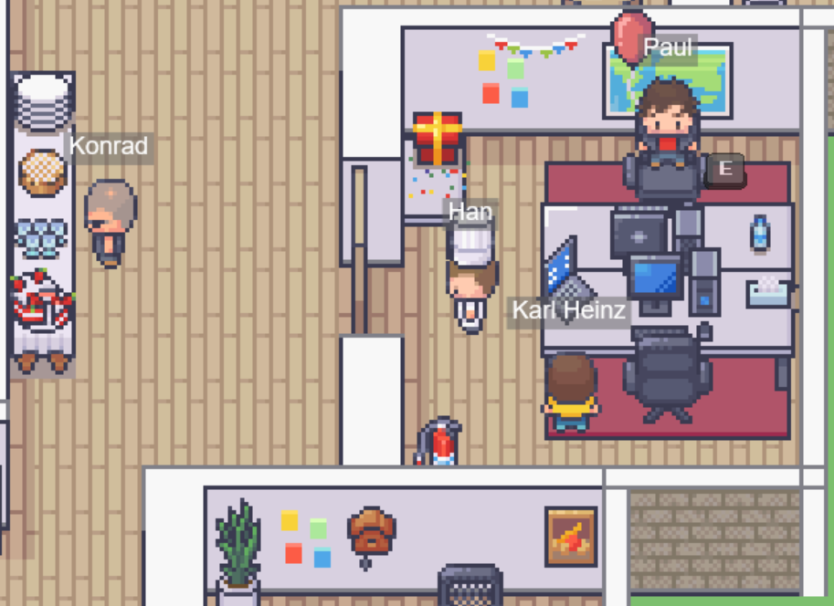

```
   ____   __  __ _          __  __             _       
  / __ \ / _|/ _(_)        |  \/  |           (_)      
 | |  | | |_| |_ _  ___ ___| \  / | __ _ _ __  _  __ _ 
 | |  | |  _|  _| |/ __/ _ \ |\/| |/ _` | '_ \| |/ _` |
 | |__| | | | | | | (_|  __/ |  | | (_| | | | | | (_| |
  \____/|_| |_| |_|\___\___|_|  |_|\__,_|_| |_|_|\__,_|
```

Welcome to the **OfficeMania** project! 
#
## Description

OfficeMania is an interactive open-source meeting soloution made for you and your team! Talk to people just as in real life, hold private meetings with interactive whiteboards or play some pong. Nearly everything is possible.

In the following you can find a summary of all dependencies we used.

[TypeScript](https://www.typescriptlang.org/) is used as the programming language both client- and server-wide. The server is based on [Node.js](https://nodejs.org/en/) (with [Express.js](https://expressjs.com/de/)) and the client scripts are generated using [webpack](https://webpack.js.org/); source code can be shared between client and server (src/common) so that, for example, client- and server-validations don't have to be written twice. Since OfficeMania is a game-like application, an [authorative server](https://www.gabrielgambetta.com/client-server-game-architecture.html) needs to synchronize its state with the clients. This communication is done using [Colyseus](https://www.colyseus.io/). All dependencies are managed using [npm](https://www.npmjs.com/). The videochat is handled through [jit.si](https://www.jitsi.org/).

If you want to host your own instance of OfficeMania you can do so by following the instuctions for the installation on native Linux or on the Windows Subsystem for Linux under Windows 11.


#
## Installation

The installation guide for self hosting can be found in the [INSTALLATION.md](INSTALLATION.md).

#
## Map customization

The guide for customizing or replacing the default map can be found in the [MODIFYMAP.md](MODIFYMAP.md).


#
## A brief introduction to OfficeMania

OfficeMania bla bla





